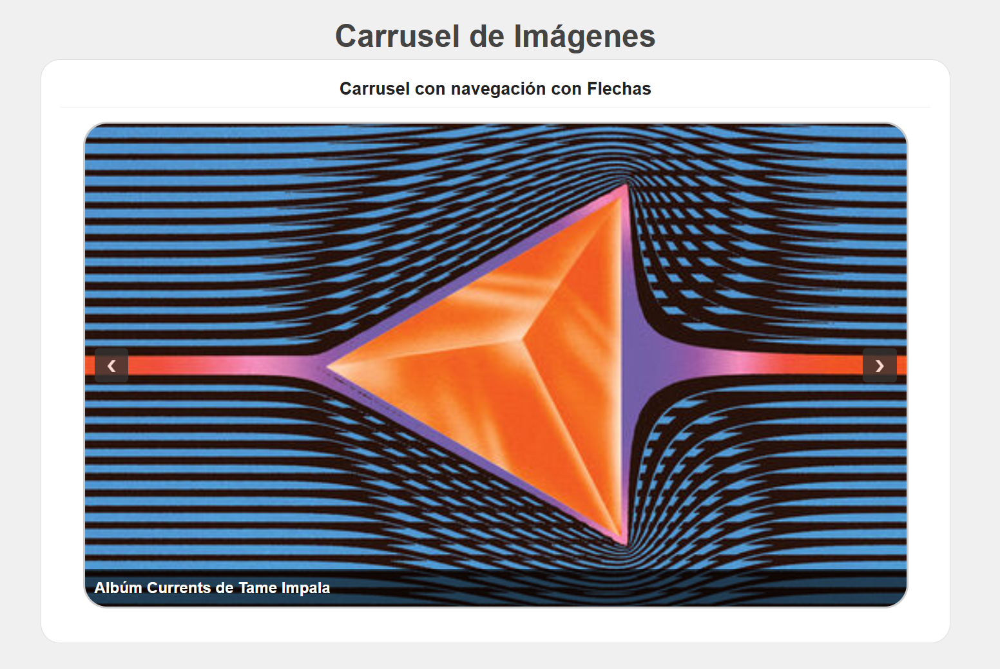
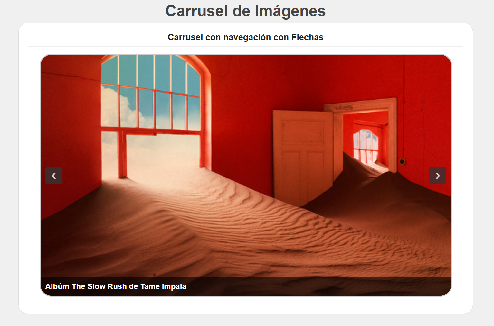

## Instituto Tecnológico de Oaxaca
## Huerta Garcia Oscar Raziel
## 7SC
## Carrusel de Imágenes Reutilizable

Componente visual interactivo y modular creado con HTML, CSS y JavaScript (sin frameworks).

---

## ¿Qué problema resuelve?
Cuando se quiere crear un paseador de imágenes o banner rotativo en una página web, lo habitual es copiar y pegar el código HTML de cada diapositiva a mano y repetir la misma lógica CSS y JS una y otra vez.

Este componente resuelve ese problema:
1. Solo se declara un `div` contenedor en el HTML.
2. Se inicializa el carrusel mediante una simple función de JavaScript, pasándole las rutas de las imágenes y sus títulos.
3. Si se necesita agregar o quitar fotos, se hace directamente en el script sin tener que reestructurar el HTML.

---

## Instalación

Para incorporar este componente a tu sitio web, sigue estos pasos:

1. Descarga y copia los archivos `js/carrusel.js` y `css/carrusel.css` a tu proyecto.
2. En tu archivo HTML, enlaza la hoja de estilos en la cabecera `<head>`:
   ```html
   <link rel="stylesheet" href="css/carrusel.css">
   ```
3. Importa el archivo JavaScript antes del cierre de la etiqueta `</body>`:
   ```html
   <script src="js/carrusel.js"></script>
   ```

---

## Uso y Ejemplos de Código

### 1. Estructura HTML
Crea un `div` vacío en tu página donde quieres que aparezca el carrusel con un `id` único:

```html
<div id="mi-carrusel"></div>
```

### 2. Inicialización en JavaScript
Llama a la función `inicializarCarrusel` pasándole el `id` de tu div y un objeto con el arreglo de las imágenes:

```html
<script src="js/carrusel.js"></script>
<script>
  inicializarCarrusel("mi-carrusel", {
    imagenes: [
      {
        url: "img/img1.png",
        titulo: "Mi Primera Diapositiva"
      },
      {
        url: "img/img2.png",
        titulo: "Segunda Imagen con Título"
      },
      {
        url: "img/img3.png",
        titulo: "Tercera Imagen de la Galería"
      }
    ]
  });
</script>
```

---

## Capturas de Pantalla

* **Carrusel en funcionamiento:**
  

* **Otras imágenes en el carrusel al darle click a las flechas:**


---



---

## Video Demostrativo

[Ver video demo de 60 segundos](https://youtu.be/aCT794qdzaE)

---

Huerta Garcia Oscar Raziel - Componente Carrusel
